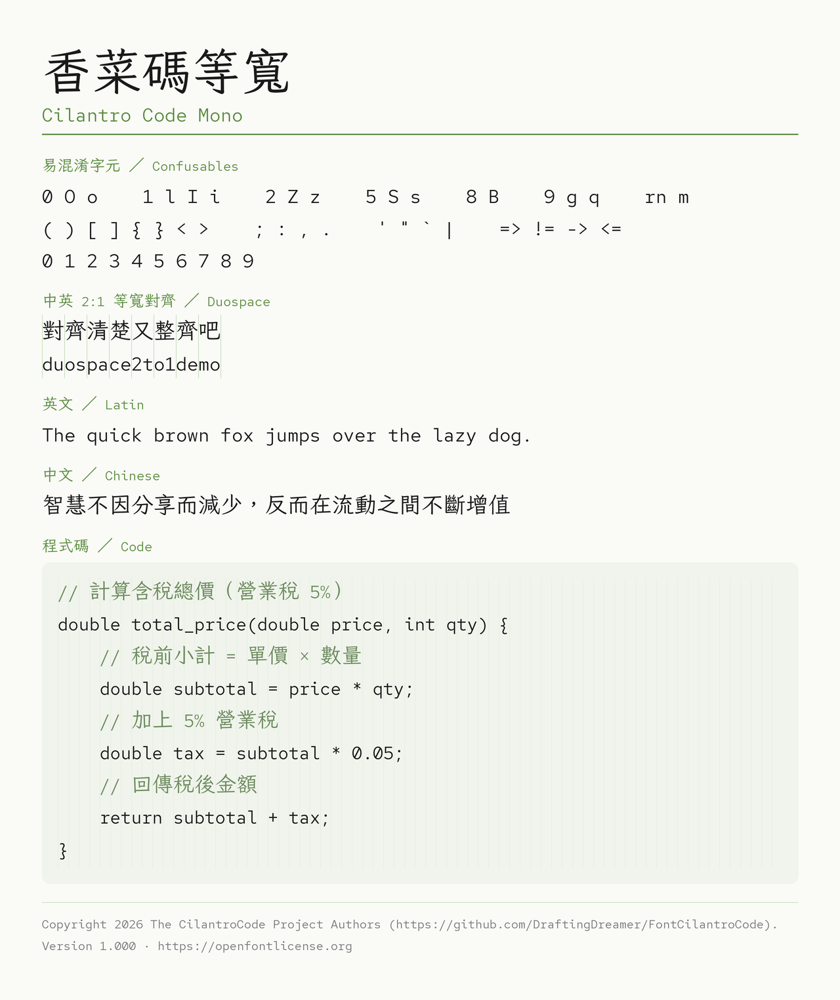

# 香菜碼等寬 Cilantro Code Mono：一個台灣程式設計師的自製字型

我做了一款字型，叫「香菜碼等寬」。

## 它從哪裡來

故事要從日本說起。2020 年底，日本老牌字型廠 **Fontworks** 把一款名叫 **Klee One** 的字型開源了。Klee 是教科書體，仿鉛筆手寫，筆畫有一種靜謐的溫度，介於楷書與印刷體之間，看著舒服。

台灣的字型設計師 **But Ko** 拿到 Klee One 之後，做了一件了不起的事：把它從頭到腳「台灣化」。他修改逾四千個字、新增兩千多字，讓每個字的寫法盡量貼近教育部標準字體，又補上台語、客語用字、注音符號與多套羅馬拼音。這款字型叫做**芫荽 Iansui**，名字本身就是台灣血統的宣示。

然後在太平洋的另一端，設計公司 **Pentagram** 的 Paula Scher 主導了 Red Hat（紅帽）的品牌重塑，委託洛杉磯的字型工作室 **MCKL** 設計企業字型。設計師 **Jeremy Mickel** 交出了一套帶有美式幾何無襯線風格的字族，其中等寬版本——**Red Hat Mono**——於 2021 年釋出，同樣採 OFL 開源。

兩套字，毫無交集。直到我出手。

## 為什麼要組合它們

我是寫程式的人，也習慣用繁體中文寫註解。這讓我長期卡在一個尷尬的處境裡：

用 Red Hat Mono，英數字漂亮、等寬、字元辨識度高，寫程式很爽，但一碰到中文，編輯器就跳回系統預設的退備字型，整排字質感突然塌陷。用芫荽，中文溫潤有型，但英數字不等寬，數字`0` 和 英文`O` 看起來太像，欄位對不齊，程式碼讀起來不方便。

兩套字各有一半的好，卻各缺另一半。

我決定自己動手接起來。以**芫荽為基底**，把 Red Hat Mono 的英數字移植進去，合併後每兩個英文字元，恰好佔一個中文字的寬度。中英文混排時，欄位整整齊齊，視覺上不再跳動。

## 最大亮點

**對齊。** 這是香菜碼最核心的設計決策。用慣了中英混排總是對不齊的字型之後，第一次看到它的效果，我覺得眼睛終於舒了一口氣。

**溫度。** 因為中文底子是芫荽，所以儘管這是一款等寬字型，它沒有那種工程字型的冷峻感。筆畫裡還留著教科書楷書的呼吸，寫滿中文的程式碼，讀起來依然親切。

**名字。** 我把它叫做「Cilantro Code Mono」，香菜碼等寬。香菜，正是芫荽的另一個稱呼，這個雙關裡藏著血緣，也藏著我對開源前輩的致意。至於「Code」，則老實交代了它的身份：這是一款專為寫程式而生的字。

## 適合誰用

如果你同時符合這幾個條件，這款字型很可能就是你在找的東西：

- 主力寫**繁體中文**程式碼或技術文件
- 在意**中英混排的欄位對齊**
- 想要一款有**手寫溫度**而不是冷冰冰工程感的字型
- 用的是**台灣慣用的字形標準**

它授權採 SIL Open Font License 1.1，完全自由使用。「Cilantro Code」和「香菜碼」是我設為保留字型名稱（Reserved Font Name）的前綴——你可以拿它做衍生，只是衍生版不能沿用這個名字。

字型本身，歡迎取用。至於香菜的味道——只有你自己知道喜不喜歡。

---

**血緣一覽**

```
Fontworks Klee One（日本教科書體, 2020）
        │
        └──► 芫荽 Iansui（But Ko／台灣在地化）───────┐
                                                  ▼
Red Hat Mono（MCKL・Pentagram／紅帽品牌字, 2021）──► 香菜碼等寬
                                                   Cilantro Code Mono
                                               （DraftingDreamer, 2026）
```


