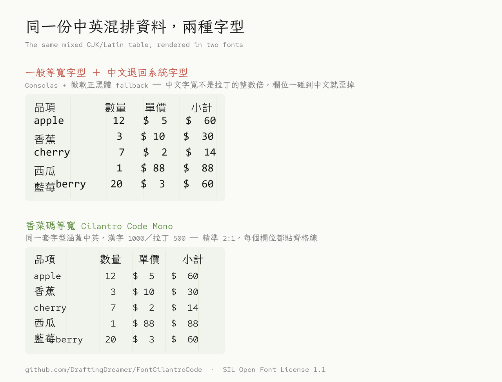

# 香菜碼等寬 Cilantro Code Mono

**為繁體中文程式設計而生的等寬字型**：中英文 **2:1 精準對齊**，字裡還留著教科書體的手寫溫度。

*A Traditional Chinese (Taiwan) monospace coding font with exact 2:1 CJK-to-Latin alignment — built on 芫荽 Iansui × Red Hat Mono, released under the SIL Open Font License 1.1.*

[](LICENSE)
[](https://github.com/DraftingDreamer/FontCilantroCode/releases/latest)
[](https://github.com/DraftingDreamer/FontCilantroCode/releases)
[](https://github.com/DraftingDreamer/FontCilantroCode/stargazers)

### [⬇ 下載最新版本](https://github.com/DraftingDreamer/FontCilantroCode/releases/latest) &nbsp;·&nbsp; [安裝說明](#安裝) &nbsp;·&nbsp; [編輯器設定](#在編輯器裡使用) &nbsp;·&nbsp; [English](#english)


---

## 它解決什麼問題

我是寫程式的人，也習慣用繁體中文寫註解。這讓我長期卡在一個尷尬的處境裡：

用 **Red Hat Mono**，英數字漂亮、等寬、字元辨識度高，寫程式很爽，但一碰到中文，編輯器就跳回系統預設的退備字型，整排字質感突然塌陷。用 **芫荽 Iansui**，中文溫潤有型，但英數字不等寬，數字 `0` 和英文 `O` 看起來太像，欄位對不齊，程式碼讀起來不方便。

兩套字各有一半的好，卻各缺另一半。

我決定自己動手接起來。以**芫荽為基底**，把 Red Hat Mono 的英數字移植進去，合併後**每兩個英文字元，恰好佔一個中文字的寬度**。中英文混排時，欄位整整齊齊，視覺上不再跳動。



## 三個特色

**對齊。** 這是香菜碼最核心的設計決策。漢字 advance width 為 1000、拉丁字元為 500（unitsPerEm = 1000），比例是數學上的精準 2:1，不是「差不多」。用慣了中英混排總是對不齊的字型之後，第一次看到它的效果，我覺得眼睛終於舒了一口氣。

**溫度。** 因為中文底子是芫荽，所以儘管這是一款等寬字型，它沒有那種工程字型的冷峻感。筆畫裡還留著教科書楷書的呼吸，寫滿中文的程式碼，讀起來依然親切。

**辨識度。** 英數字來自 Red Hat Mono，`0` 帶斜線、`1`／`l`／`I` 各有明確差異、`rn` 不會誤讀成 `m`——這些正是程式字型該處理好的細節。

## 適合誰用

如果你同時符合這幾個條件，這款字型很可能就是你在找的東西：

- 主力寫**繁體中文**程式碼、註解或技術文件
- 在意**中英混排的欄位對齊**（表格、註解區塊、CJK 終端機輸出）
- 想要一款有**手寫溫度**而不是冷冰冰工程感的字型
- 用的是**台灣慣用的字形標準**（教育部標準字體）

## 安裝

先到 [Releases 頁面](https://github.com/DraftingDreamer/FontCilantroCode/releases/latest)下載 `CilantroCodeMono-Regular.ttf`。

| 系統 | 安裝方式 |
|------|----------|
| **Windows** | 對 `.ttf` 按右鍵 →「安裝」（只裝給自己）或「為所有使用者安裝」（需系統管理員權限） |
| **macOS** | 雙擊 `.ttf` → 在「字體簿」按「安裝字體」 |
| **Linux** | 複製到 `~/.local/share/fonts/`，然後執行 `fc-cache -fv` |

Linux 一行安裝：

```bash
mkdir -p ~/.local/share/fonts && cp CilantroCodeMono-Regular.ttf ~/.local/share/fonts/ && fc-cache -fv
```

## 在編輯器裡使用

字型家族名稱為 **`Cilantro Code Mono`**（中文環境會顯示為「香菜碼等寬」，兩個名稱指向同一套字，設定檔請用英文名以免編碼問題）。

**VS Code** — `settings.json`：

```json
{
  "editor.fontFamily": "'Cilantro Code Mono', monospace",
  "editor.fontSize": 15,
  "terminal.integrated.fontFamily": "'Cilantro Code Mono'"
}
```

**JetBrains IDE**（IntelliJ / PyCharm / WebStorm）：`Settings → Editor → Font → Font: Cilantro Code Mono`

**Windows Terminal** — `settings.json`：

```json
{
  "profiles": {
    "defaults": {
      "font": { "face": "Cilantro Code Mono", "size": 12 }
    }
  }
}
```

**Vim / Neovim（GUI）**：

```vim
set guifont=Cilantro\ Code\ Mono:h14
```

**CSS / 網頁**：

```css
code, pre {
  font-family: "Cilantro Code Mono", ui-monospace, monospace;
}
```

> **小提醒**：字級建議 14px 以上。楷書筆畫比黑體纖細，字級太小時中文的細節會糊掉。

## 規格

| 項目 | 內容 |
|------|------|
| 版本 | 1.000 |
| 字重 | Regular（400）一款 |
| 格式 | TrueType（`.ttf`），unitsPerEm = 1000 |
| 字符數 | 15,618 個 glyph／12,762 個 Unicode 碼位 |
| 寬度 | 漢字 1000、拉丁與符號 500（精準 2:1） |
| 漢字覆蓋 | CJK 統一漢字 10,017 字 ＋ 擴充 A 區 127 字 |
| 其他覆蓋 | 注音符號 43、日文假名 187、希臘 54、西里爾 66、Latin-1 補充 95 |
| 授權 | SIL Open Font License 1.1（保留字型名稱：`Cilantro Code`、`香菜碼`） |

## 已知限制

老實交代，免得你裝了才失望：

- **只有 Regular 一個字重。** 沒有 Bold、沒有 Italic。編輯器裡的粗體與斜體會由系統即時合成（或退回其他字型），效果不一定理想。
- **沒有 programming ligature。** `=>`、`!=`、`->` 不會合併成連字符號。（如果你本來就討厭 coding ligature，這反而是好消息。）
- **檔案 9.5 MB。** 完整 CJK 字型的合理體積，但直接當網頁字型偏大，建議自行做 subset 或轉 WOFF2。
- **未涵蓋罕用字。** CJK 擴充 B 區以後的字未收錄，繼承自芫荽的字符集範圍。

歡迎到 [Issues](https://github.com/DraftingDreamer/FontCilantroCode/issues) 回報字符問題或提出建議。

## 它從哪裡來

故事要從日本說起。2020 年底，日本老牌字型廠 **Fontworks** 把一款名叫 **Klee One** 的字型開源了。Klee 是教科書體，仿鉛筆手寫，筆畫有一種靜謐的溫度，介於楷書與印刷體之間，看著舒服。

台灣的字型設計師 **But Ko** 拿到 Klee One 之後，做了一件了不起的事：把它從頭到腳「台灣化」。他修改逾四千個字、新增兩千多字，讓每個字的寫法盡量貼近教育部標準字體，又補上台語、客語用字、注音符號與多套羅馬拼音。這款字型叫做 **芫荽 Iansui**，名字本身就是台灣血統的宣示。

然後在太平洋的另一端，設計公司 **Pentagram** 的 Paula Scher 主導了 Red Hat（紅帽）的品牌重塑，委託洛杉磯的字型工作室 **MCKL** 設計企業字型。設計師 **Jeremy Mickel** 交出了一套帶有美式幾何無襯線風格的字族，其中等寬版本——**Red Hat Mono**——於 2021 年釋出，同樣採 OFL 開源。

兩套字，毫無交集。直到我出手。

至於名字：「Cilantro」（香菜）正是芫荽的另一個稱呼，這個雙關裡藏著血緣，也藏著我對開源前輩的致意。「Code」則老實交代了它的身份——這是一款專為寫程式而生的字。

字型本身，歡迎取用。至於香菜的味道——只有你自己知道喜不喜歡。

**血緣一覽**

```
Fontworks Klee One（日本教科書體, 2020）
        │
        └──► 芫荽 Iansui（But Ko／台灣在地化）───────┐
                                                  ▼
Red Hat Mono（MCKL・Pentagram／紅帽品牌字, 2021）──► 香菜碼等寬
                                                   Cilantro Code Mono
                                               （DraftingDreamer, 2026）
```

## 授權

本字型採 [SIL Open Font License 1.1](LICENSE) 釋出，可自由使用於商業與非商業用途、可修改、可再散布，唯不得單獨販售。

「Cilantro Code」與「香菜碼」為**保留字型名稱（Reserved Font Name）**——你可以拿它做衍生版本，只是衍生版不能沿用這兩個名稱。

上游著作權聲明：

- Portions Copyright 2025 The Iansui Project Authors — [ButTaiwan/iansui](https://github.com/ButTaiwan/iansui)
- Portions Copyright 2024 The Red Hat Project Authors — [RedHatOfficial/RedHatFont](https://github.com/RedHatOfficial/RedHatFont)

## 致謝

- **But Ko（@ButTaiwan）** — 芫荽 Iansui，本字型的中文骨架，也是台灣字型在地化的重要作品
- **Fontworks** — 開源 Klee One，一切的起點
- **MCKL / Jeremy Mickel、Pentagram** — Red Hat Mono，本字型的英數字來源

---

## English

**Cilantro Code Mono (香菜碼等寬)** is a free and open-source **monospace coding font for Traditional Chinese (Taiwan)**.

It merges two OFL-licensed fonts: **[Iansui](https://github.com/ButTaiwan/iansui)** — a Taiwanese localization of Fontworks' *Klee One* textbook typeface, redrawn to follow Taiwan's Ministry of Education standard character forms — provides the Han characters, while **[Red Hat Mono](https://github.com/RedHatOfficial/RedHatFont)** by MCKL provides the Latin, digits, and symbols.

**Why it exists:** most CJK coding setups fall back to a different font for Chinese, breaking both the rhythm and the column alignment. Cilantro Code Mono fixes this with **exact 2:1 duospace metrics** — Han characters advance 1000 units, Latin characters advance 500 (upem = 1000) — so two Latin characters occupy exactly one Han character cell. Columns line up, and the code keeps the gentle, hand-written warmth of a textbook typeface instead of the usual engineered coldness.

**Highlights**

- Exact 2:1 CJK-to-Latin alignment — no more jittering columns in mixed-script code
- 10,017 CJK Unified Ideographs + 127 Ext-A, following Taiwan MOE standard forms
- Bopomofo (注音), Kana, Greek, Cyrillic, and Latin-1 Supplement coverage
- Highly legible Latin from Red Hat Mono: slashed zero, disambiguated `1` / `l` / `I`
- SIL Open Font License 1.1 — free for commercial use

**Known limitations:** Regular weight only (no Bold or Italic), no programming ligatures, 9.5 MB file size.

**Install:** download the `.ttf` from [Releases](https://github.com/DraftingDreamer/FontCilantroCode/releases/latest), then set your editor font family to `Cilantro Code Mono`.

**Keywords:** Traditional Chinese monospace font · CJK coding font · duospace · 繁體中文等寬字型 · 程式設計字型 · Taiwan · Iansui · Red Hat Mono · SIL OFL
